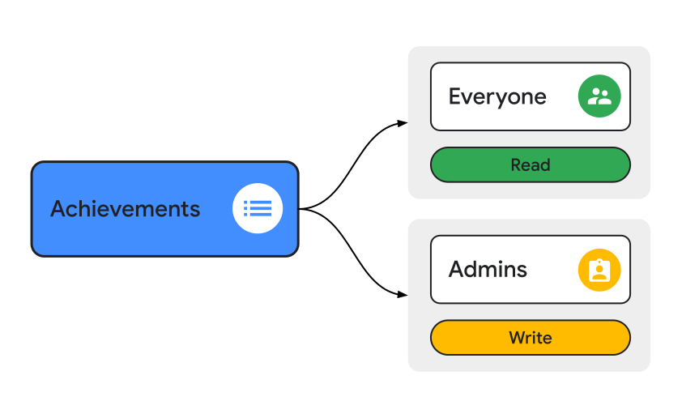

    <h1><b>Achievements</b></h1>

Achievements are stored in `Firebase Firestore Database` (`FS`)

The achievements an user obtained are stored as a list of IDs, under the user public data document (`/users/user/public/general`)

## First website prototype

## Rules

<a>{width=700}</a>
