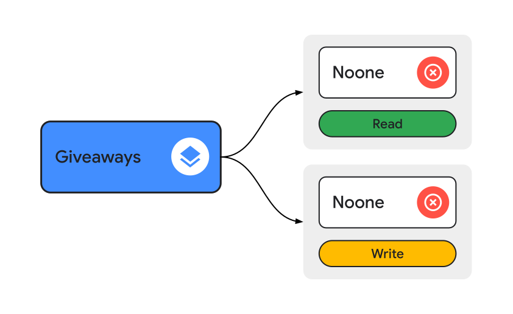

<div align='center'>
    <h1><b>Giveaways</b></h1>
</div>

Giveaways are stored in a `Firebase Realtime Database` (`RTD`) in Belgium (`europe-west1`)

They are available at [<kbd>/giveaways</kbd>](https://rahneil-n3-co-default-rtdb.europe-west1.firebasedatabase.app/giveaways).


## Rules

{width=700}

<details><summary>Click to see full rules as code</summary>
<br/>

```
".read": false,
".write": false
```
</details>
